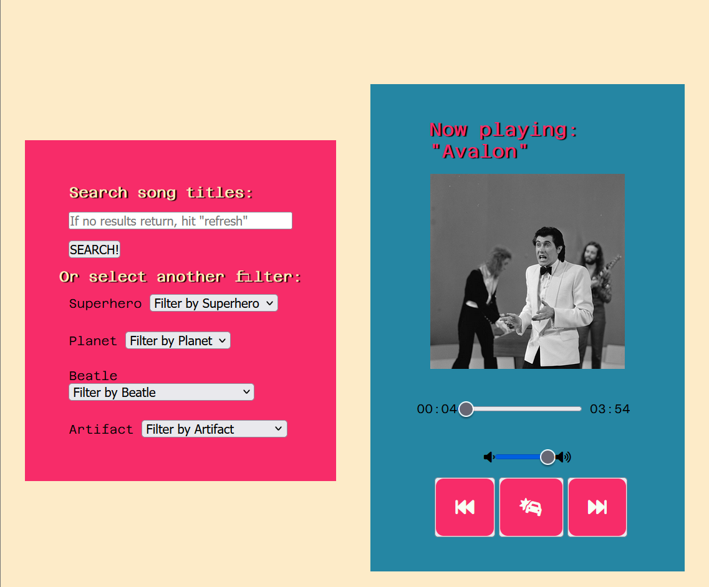
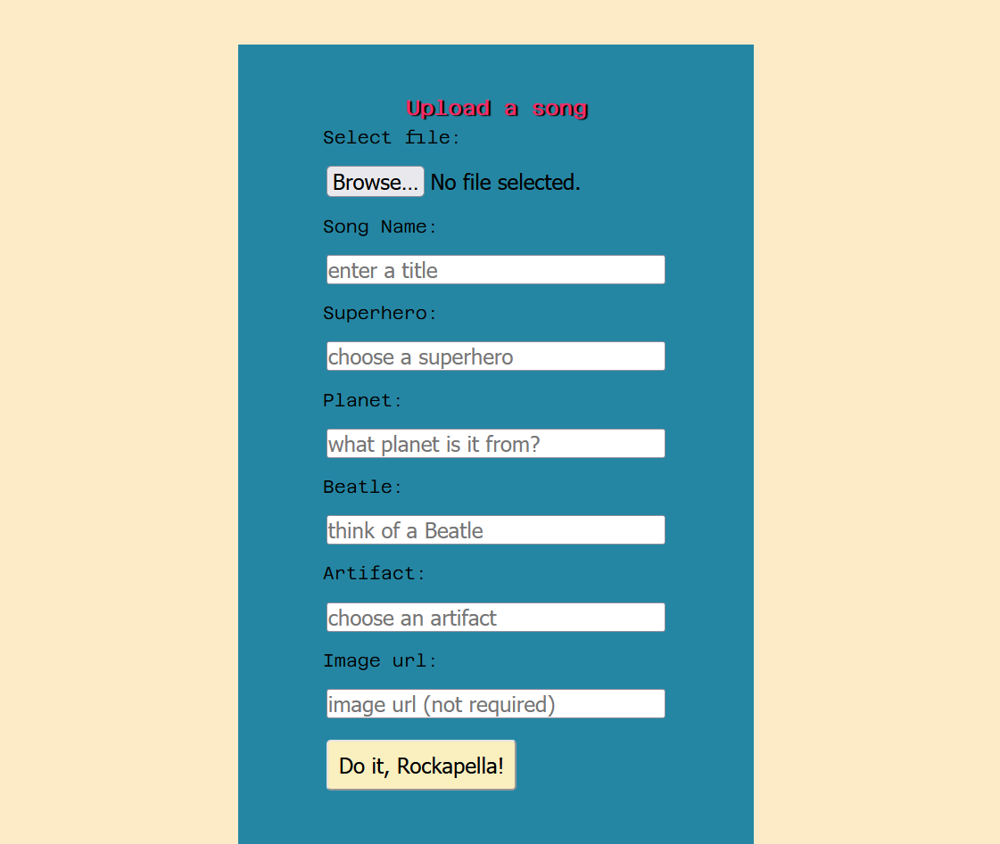
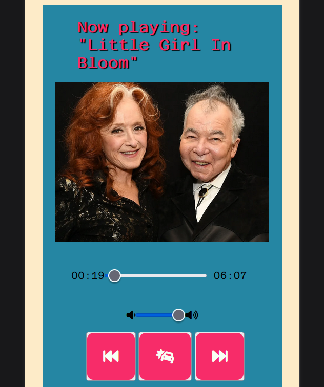
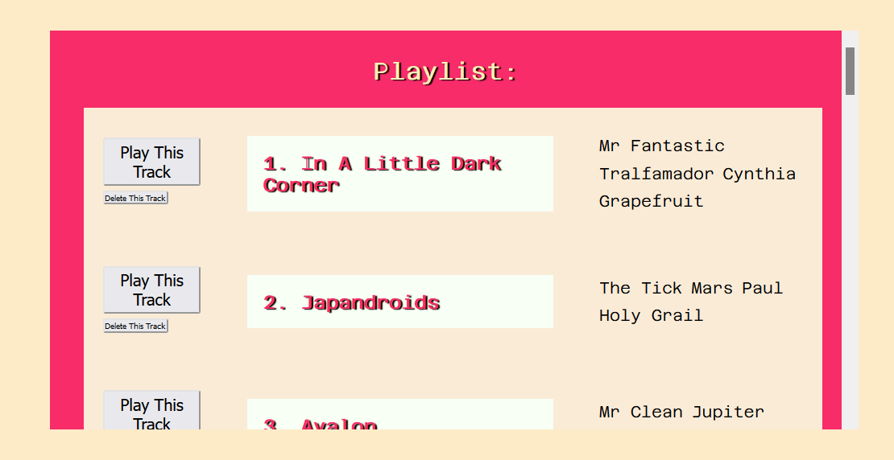
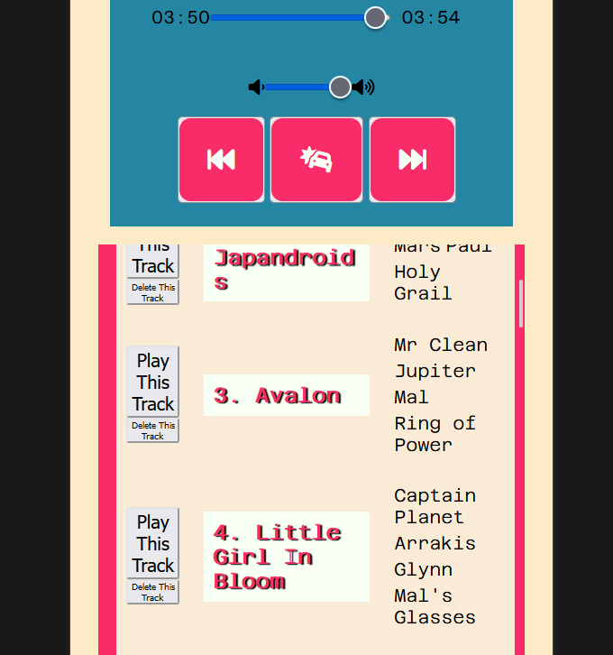

# Quit Music, Go Back To School

## A full stack music storage and playback app

### I built this app as the final project for my Bootcamp at Austin Community College.
## The front end is EJS and responsive CSS. The back end is Express, MongoDB, and Google Cloud. Authentication via Passport.
## It supports mp3 upload, metadata editing, search and filter by title and tag, soft deletion (the metadata is deleted from Mongo but the track is retained in Google Cloud), and music playback.

I used to be in this band, and we were always recording. Any time we practiced, someone had their iPhone voice memos app going. This was great in terms of the creative process, but it was a nightmare to keep track of all the audio files. We had a chaotic system spread across several different SoundCloud and Google Drive accounts (all of which would try to prevent us from sharing a password, thinking we were constantly hacking each other).

We also needed some kind of organization system for the songs, but it needed to be very loose. 
Let's say you're working on a song called "I Want To Hold Your Hand," and you iterate through 99 different versions of it over the course of however long. Each time, your recording app asks you what the song title is.
### Riddle me this, you genius recording app... what's the title of this song going to be each and every time?
That's right. It's always gonna be "I Want To Hold Your Hand." Sure, you can start numbering them. But nothing sucks the joy out of the artistic process for me quicker than looking at titles like "I Want To Hold Your Hand version 04" or "I Want To Hold Your Hand 16." What if you forget the word "version," or if you use "9" instead of "09?" Everything will be listed out of order. And what are the odds you'll immediately forget the differences between versions 01 and 876?

What I needed were some arbitrary word tags. Things that were meaningful to me but not directly semantic, so I could make broad and artistic connections between the songs instead of direct and literal ones. 

So I thought about my favorite categories of things... What are some buckets from which I can generate endless examples? Buckets that are interesting enough that they're fun to riff on? 

Hence: superhero, planet, Beatle (you don't have to limit yourself to just the main 4), and artifact (I was getting back into Magic: The Gathering)

# Search/Filter Widget and Mp3 Player

# Upload Widget

# Mobile Player

# Playlist Interface, With Editable Metadata

